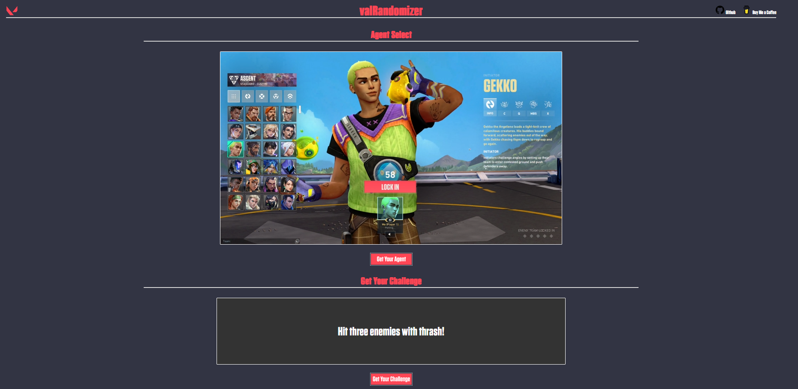

# valRandomizer

Randomized agent selection and generation of challenges to complete in-game, designed to spice up your VALORANT experience.

Built with Angular and OpenAI API.

# Setup The Latest Build Locally
This application is not yet hosted on a domain as it is a WIP, so you'll have to download the source code and run it on a localhost server.
- Install Angular if you don't have it installed

  `npm install -g @angular/cli`

- Clone this repo to your local machine

  `git clone https://github.com/erik-bobinski/valRandomizer.git`

- Once the code has been downloaded

  `cd your-installation-directory`

- Install the depencies

  `npm install` 

- Run the application 

  `ng serve`
  
- Navigate To The Localhost Port Specified In Your CLI To See Your App Running
